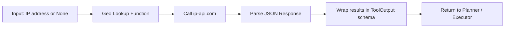

# Geo Tool  
### Documentation by Keith Baskerville  

---
## Table of Contents  
- [Step 1 – Import Packages](#step-1--import-packages)  
- [Step 2 – Define ToolOutput Schema](#step-2--define-tooloutput-schema)  
- [Step 3 – Create Geo Lookup Function](#step-3--create-geo-lookup-function)  
- [Step 4 – Wrap Function as StructuredTool](#step-4--wrap-function-as-structuredtool)  
- [Step 5 – Test the Geo Tool](#step-5--test-the-geo-tool)  

---

### Step 1 – Import Packages  
<details>
<summary>📂 Code</summary>

```python
import requests
import os
from typing import Optional, Any
from pydantic import BaseModel
from langchain_core.tools import StructuredTool
```

</details>

**Explanation:**  
Imports necessary libraries for HTTP requests, environment variables, type hints, Pydantic schemas, and LangChain tools.  

---

### Step 2 – Define ToolOutput Schema  
<details>
<summary>📂 Code</summary>

```python
# Defines schema for tool outputs
class ToolOutput(BaseModel):
    tool: str
    input: Any
    output: Any
    step: Optional[str] = None
```

</details>

**Explanation:**  
`ToolOutput` ensures **all tools return a consistent structure**.  
- `tool`: name of the tool used  
- `input`: what was provided to the tool  
- `output`: the results the tool returns  
- `step`: optional metadata for the planner/executor  

**How geo_tool uses it:**  
When `geo_tool` runs, it returns a `ToolOutput` instance containing the resolved city, state, and country. This ensures downstream agents (Planner → RAG → Executor) can reliably parse and use the result.  

---

### Step 3 – Create Geo Lookup Function  
<details>
<summary>📂 Code</summary>

```python
def get_location_from_ip(ip: Optional[str] = None) -> ToolOutput:
    """
    Uses ip-api.com to get location info from IP.
    If no IP provided, falls back to server IP.
    """
    if not ip:
        ip = os.getenv("IP_ADDRESS")
    url = f"http://ip-api.com/json/{ip}"
    response = requests.get(url)
    data = response.json()

    if data.get("status") != "success":
        raise ValueError(f"Could not get location for IP {ip}")
    
    return ToolOutput(
        tool="geo_location",
        input={"ip": ip},
        output={"city": data.get("city"), "state": data.get("region"), "country": data.get("country")},
        step="geo_location"
    )
```

</details>

**Explanation:**  
This function calls `ip-api.com` to resolve an IP into `city`, `state`, and `country`. It returns a **`ToolOutput` object**, so the Planner can use it immediately in its execution plan or pass it to RAG/Executor.  

---

### Step 4 – Wrap Function as StructuredTool  
<details>
<summary>📂 Code</summary>

```python
geo_tool = StructuredTool.from_function(
    func=get_location_from_ip,
    name="geo_location",
    description="Get city, state, and country from an IP address.",
    step="geo_location"
)
```

</details>

**Explanation:**  
Wrapping the function as a `StructuredTool` allows the Planner or Executor to **invoke it programmatically** with inputs. The `ToolOutput` ensures all downstream agents can read the result consistently.  

---

### Step 5 – Test the Geo Tool  
<details>
<summary>📂 Code</summary>

```python
if __name__ == "__main__":
    # Test with no IP (defaults to server IP)
    location = geo_tool.invoke({"ip": None}, verbose=True)
    print(location)
    
    # Test with specific IP
    test_ip = "8.8.8.8"
    location = geo_tool.invoke({"ip": test_ip}, verbose=True)
    print(location)
```

</details>

**Explanation:**  
Run this to confirm the tool resolves IP addresses correctly and returns a structured `ToolOutput` compatible with the Planner.  

---

## Geo Tool Flow Diagram  



**Explanation:**  
Shows the step-by-step flow: input → API call → parse → structured output for agents.
