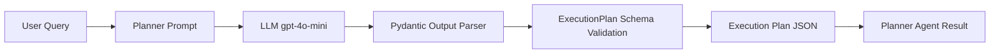

# Planner Agent Build  
### Documentation by Keith Baskerville  

---
## Table of Contents  
- [Step 1 – Define Pydantic Schema](#step-1--define-pydantic-schema)  
- [Step 2 – Import Packages](#step-2--import-packages)  
- [Step 3 – Define Model for Planner Agent](#step-3--define-model-for-planner-agent)  
- [Step 4 – Load Output Parser](#step-4--load-output-parser)  
- [Step 5 – Create System Message](#step-5--create-system-message)  
- [Step 6 – Create Prompt Template](#step-6--create-prompt-template)  
- [Step 7 – Set Up Planner Chain](#step-7--set-up-planner-chain)  
- [Step 8 – Create Planner Agent](#step-8--create-planner-agent)  
- [Step 9 – Test the Planner Agent](#step-9--test-the-planner-agent)  

---

### Step 1 – Define Pydantic Schema  
<details>
<summary>📂 Code</summary>

```python
from pydantic import BaseModel, Field
from typing import List

# Defines schema for the Plan
class ExecutionPlan(BaseModel):
    plan: List[str] = Field(
        description="A list of steps to execute in order to answer a prompt"
    )
```

</details>

**Explanation:**  
This schema defines the structure of the execution plan. It ensures the model always outputs a JSON list of steps.  

---

### Step 2 – Import Packages  
<details>
<summary>planner_agent.py</summary>

```python
from langchain_core.prompts import ChatPromptTemplate
from langchain_core.output_parsers import PydanticOutputParser
from langchain_openai import ChatOpenAI
from app.models.schemas import ExecutionPlan
import os
from dotenv import load_dotenv

load_dotenv()
OPENAI_API_KEY = os.getenv("OPENAI_API_KEY")
```
</details>

**Explanation:**  
This step loads all required libraries and environment variables. We use `dotenv` to pull in the `OPENAI_API_KEY` so the agent can connect to OpenAI.  

---

### Step 3 – Define Model for Planner Agent  
<details>
<summary>📂 Code</summary>

```python
planner_llm = ChatOpenAI(model="gpt-4o-mini", temperature=0, openai_api_key=OPENAI_API_KEY)
```

</details>

**Explanation:**  
Here we initialize the LLM (language model) that powers the planner. The `temperature=0` setting ensures consistent and predictable outputs.  

---

### Step 4 – Load Output Parser  
<details>
<summary>📂 Code</summary>

```python
plan_parser = PydanticOutputParser(pydantic_object=ExecutionPlan)
```

</details>

**Explanation:**  
The output parser converts the LLM’s raw text response into structured JSON. It also validates that the data matches our `ExecutionPlan` schema.  

---

### Step 5 – Create System Message  
<details>
<summary>📂 Code</summary>

```python
system_message = f"""
You are a research planner. Break the user's query into a list of ordered steps.
Important guidelines:
- Keep concise
- Always return steps as JSON following these format instructions:
{{format_instructions}}
- Do not include any text outside of the JSON.
"""
```

</details>

**Explanation:**  
This system message defines the planner’s role and enforces formatting rules so responses always follow JSON structure.  

---

### Step 6 – Create Prompt Template  
<details>
<summary>📂 Code</summary>

```python
planner_prompt = ChatPromptTemplate.from_messages([
   ("system", system_message),
   ("human", "{query}")
])
```

</details>

**Explanation:**  
The planner prompt combines system instructions with the user’s query, ensuring structured input for the model.  

---

### Step 7 – Set Up Planner Chain  
<details>
<summary>📂 Code</summary>

```python
planner_chain = (
    planner_prompt.partial(format_instructions=plan_parser.get_format_instructions()) 
    | planner_llm 
    | plan_parser
)
```

</details>

**Explanation:**  
This chain links the prompt → model → parser. The model generates steps, and the parser ensures the output is structured as valid JSON.  

---

### Step 8 – Create Planner Agent  
<details>
<summary>📂 Code</summary>

```python
def planner_agent(query: str):
    result = planner_chain.invoke({"query": query})
    return result
```

</details>

**Explanation:**  
The `planner_agent` function takes in a user query, runs it through the chain, and returns a validated execution plan.  

---

### Step 9 – Test the Planner Agent  
<details>
<summary>📂 Code</summary>

```python
raw_output = (
    planner_prompt.partial(format_instructions=plan_parser.get_format_instructions()) 
    | planner_llm
).invoke(
    {"query": "What are the key differences between photosynthesis and cellular respiration?"}
)

print(raw_output.content)
```

</details>

**Explanation:**  
This test runs a sample query through the agent and prints the raw JSON output, verifying that the planner works as expected.  

---

## Planner Flow Diagram  


