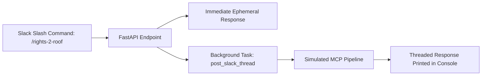

---

# Rights2Roof Slack Webhook

### Documentation by Keith Baskerville

---

## Table of Contents

* [Step 1 – Import Packages](#step-1--import-packages)
* [Step 2 – Initialize FastAPI App](#step-2--initialize-fastapi-app)
* [Step 3 – Configure Logging](#step-3--configure-logging)
* [Step 4 – Create Helper Function: Post Threaded Response](#step-4--create-helper-function-post-threaded-response)
* [Step 5 – Create Slack Slash Command Endpoint](#step-5--create-slack-slash-command-endpoint)
* [Step 6 – Root Endpoint](#step-6--root-endpoint)
* [Step 7 – Testing the Endpoint](#step-7--testing-the-endpoint)
* [Step 8 – Flow Diagram](#step-8--flow-diagram)

---

### Step 1 – Import Packages

<details>
<summary>📂 slack_webhook.py</summary>

```python
from fastapi import FastAPI, Form
import asyncio
import os
import logging
```

</details>

**Explanation:**
Imports FastAPI, asyncio for background tasks, os for environment variables, and logging to track activity.

---

### Step 2 – Initialize FastAPI App

<details>
<summary>📂 Code</summary>

```python
app = FastAPI(title="Rights-2-Roof Slash Command")
```

</details>

**Explanation:**
Creates a FastAPI instance to handle incoming Slack requests.

---

### Step 3 – Configure Logging

<details>
<summary>📂 Code</summary>

```python
logging.basicConfig(level=logging.INFO)
```

</details>

**Explanation:**
Enables logging so you can track requests and background tasks in the console.

---

### Step 4 – Create Helper Function: Post Threaded Response

<details>
<summary>📂 Code</summary>

```python
async def post_slack_thread(channel_id: str, user_id: str, query_text: str):
    """
    Simulates MCP response for testing purposes.
    """
    try:
        logging.info(f"[Right2Roof Bot] simulating pipeline for {user_id}:{query_text}")

        # simulate final answer
        final_answer = f"Simulated housing info for query: '{query_text}' "

        # simulate async posting delay
        await asyncio.sleep(1)

        logging.info(f"[Right2Roof Bot] Finished simulated response for {user_id}")
        print(f"[Thread] Channel: {channel_id} | User: {user_id} | Answer: {final_answer}")

    except Exception as e:
        logging.exception(f"[HousingBot] Error in simulated pipeline")
```

</details>

**Explanation:**
This function represents where the MCP pipeline will eventually run. For now, it simulates an async response and prints the result to the console.

---

### Step 5 – Create Slack Slash Command Endpoint

<details>
<summary>📂 Code</summary>

```python
@app.post("/slack/rights-2-roof")
async def slack_roof(
    text: str = Form(...),
    user_id: str = Form(...),
    channel_id: str = Form(...),
):
    """
    Handles /rights-2-roof <query> slash command from Slack.
    Responds immediately, then posts final answer asynchronously.
    """

    # Step 1: Respond immediately to Slack
    ephemeral_response = {
        "response_type": "ephemeral",
        "text": f"Got it! Running Rights2Roof search for: {text}"
    }

    # Step 2: Trigger background task for final answer
    asyncio.create_task(post_slack_thread(channel_id, user_id, text))

    return ephemeral_response
```

</details>

**Explanation:**

* Responds to Slack immediately with an **ephemeral message**.
* Launches a background task to simulate posting the final answer in a thread.

---

### Step 6 – Root Endpoint

<details>
<summary>📂 Code</summary>

```python
@app.get("/")
def root():
    return {"message": "Rights2Roof Slack webhook is running"}
```

</details>

**Explanation:**
Provides a quick health check to verify that the FastAPI server is running.

---

### Step 7 – Testing the Endpoint

#### Using Postman

1. **Set Method & URL**

   * Method: `POST`
   * URL: `http://127.0.0.1:8000/slack/rights-2-roof`

2. **Set Body**

   * Type: `x-www-form-urlencoded`
   * Fields:

     | Key          | Value                          |
     | ------------ | ------------------------------ |
     | `text`       | `I need help with rent in NYC` |
     | `user_id`    | `U123456`                      |
     | `channel_id` | `C123456`                      |

3. **Send Request**

   * You should receive a JSON response:

     ```json
     {
       "response_type": "ephemeral",
       "text": "Got it! Running Rights2Roof search for: I need help with rent in NYC"
     }
     ```
   * Check your console/logs to see the simulated threaded response:

     ```
     [Thread] Channel: C123456 | User: U123456 | Answer: Simulated housing info for query: 'I need help with rent in NYC'
     ```

---

#### Using cURL

```bash
curl -X POST http://127.0.0.1:8000/slack/rights-2-roof \
  -d "text=I need help with rent in NYC" \
  -d "user_id=U123456" \
  -d "channel_id=C123456"
```

**Expected Response:**

```json
{
  "response_type": "ephemeral",
  "text": "Got it! Running Rights2Roof search for: I need help with rent in NYC"
}
```

**Notes:**

* Make sure **python-multipart** is installed:

  ```bash
  pip install python-multipart
  ```
* Run the server with:

  ```bash
  uvicorn app.services.slack_webhook:app --reload
  ```

---

### Step 8 – Flow Diagram



---

